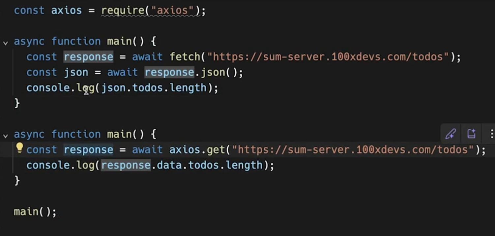

## ** READ THE OFFICIAL DOCUMENTS **
[Axios GitHub Repository](https://github.com/axios/axios?asd=asdasdds)

* Below these 2 code is same one using aynch/await and one is promises but itis using fetch
  

* Axios Vs Fetch 
  * IN axios not need to define response as a json axious is smart enough.
   
  
  * If in case data is not in json ,then in such case axios is able to fetch the data in given any data types
  
  * Data is nothing but the body here
  