## `HTML TAGS ( some imp tags) `
* html
* head
* title
* body
* div ( takes all space horizontally ) 
* span( takes space horizontally as nedded )
* h1....h6
* p
* img
* a
* input
* button
* b / i
* centre
* br

##### Attributes
* 
  

## `CSS` 
##### 1. BASICS 
* Some basics Css, background,shadow,border,font-size,border-radius 
* Code :- 
  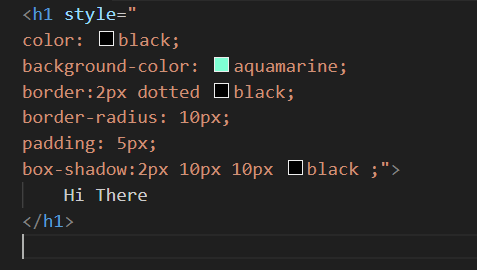
* Output :- 
##### NOTE : Use Inspect for try and error 

* 
  
##### Remove and back to normal after reloading pages!!!!!!!!!!!
* 
  

##### 2. some Important things to know. 
* Use flex box concept with div to postioning the element.
* Dont use float and absoulte postioning.
* Padding use indside Div to postioning components inside div.
* Margin use out side a div to postioning components inside div and to postioning Div also.
  
## `JAVA SCRIPT`
### `WEEK 1`
### `1.` `BASICS `
* CONTENT 
  * 1.1 Why language?
  * 1.2 Interpreted vs compiled languages
  * 1.3 Why JS >> Other languages in some use-cases
  * 1.4 Strict vs dynamic languages
  * 1.5 Single threaded nature of JS
  * 1.6 Simple primitives in JS (number, strings, booleans)
  * 1.7 Complex primitives in JS (arrays, objects)
  * 1.8 Functions in Javascript
  * 1.9 Callback functions, Event loop, callback queue, Asynchronous programming

#### `1.1` WHY Language?? 
* languages help to write an application , where as human communicate human with machine by the help of Interpreter and compiler , bcoz machine cant understand high level languages.

#### `1.2` Interpreted vs compiled languages
* Compiler 
  * Compiler firest need to compile whole thingh, then need to run
  * Stop if there is any error in between 
  * Ex:- C++,java,rust,golang

* Interpreter
  * Go line by line
  * Can run partially if there is an error
  * Ex: js, py
  
#### `1.4` Strict vs dynamic languages
* In strict lang u have to mention datatype and in dynamics it will recoginize it automatically.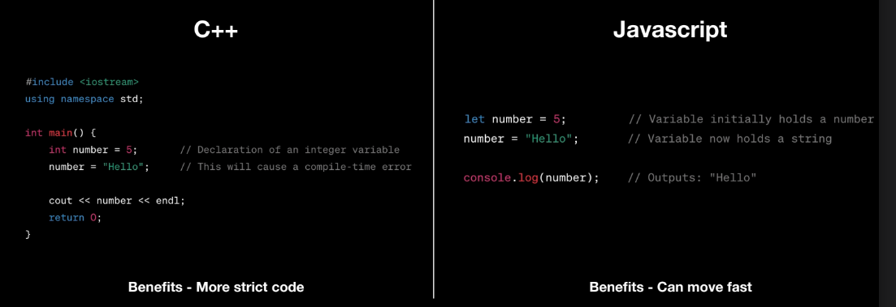

#### `1.5` Single threaded nature of JS
* Interpreter language are mostly slow bcoz of single core or single thread.

#### `NOTE :`
* We can make a array of objects also 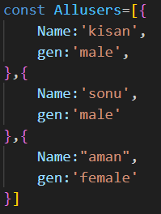

#### `1.6` Functions

* Abstract out logic in your program
* Take arguments as an input
* Return a value as an output
* You can think of them as an independent program that is supposed to do something given an input
* Functions can take other functions as input or function used as parameter or function passed as argumnmet to other function (`callbacks :` used in asynch funcion)
* Normally 
  * Input code:
    
  * Output : 
  

* Without callbacks 
  * Input code:
    
  * Output:
  
   
* With Callbacks
  * Input code:
    
  * Output: 
  

* CALLBACK IS USED IN REAL TIME PROJECT 
  * One example is the setTimeout , output after 5 sec appears
   

#### `1.7` Callback functions real used in asynch funcion , JS arch (Event loop,Callback queue) Asynchronous programming

##### Synchronous programmming
* In sequence step by step

##### ASynchronous programmming
* Context switching in between the process or doing parallely the given process

##### `For Ex:` There is a process of froming maggi 
* So the time taken for `(Synchronous)`  5 min for water boling + 5 min chopeing veges + 5 min to purchase sauce from market + 5 min maggi preperation.
* Total time by synchronously is 20 mins
* And for the `(Asynchronous)` 5 min for water boiling,chopeing veges + 5 min maggi preperation
* Total time by Asynchronously is 10 mins
  
##### How does JS do the same? Can js delegate? can Js context switch
* ASynch example in which setTimeout is asynch function define by js only
* `Examples:`
* `1.` 
       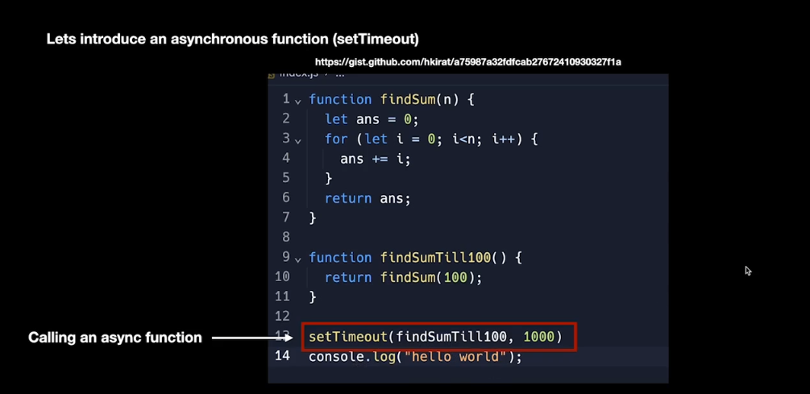
       
* `2.` 
       
       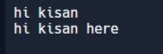
* `3.` In below example we see that output of a.txt is showing after a "hi there 2" even though reading file is complete the main thread is busy some where else .
  
  

* Synchronus example 
  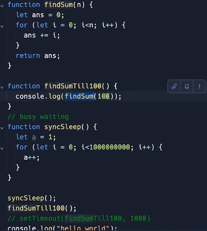
  

##### Visualize how asynch nature is working by wisting this link http://latentflip.com/loupe/

#### `1.8`  Promises
* Promises are syntactical sugar that make callback function more readable
* DEf :-A Promise in JavaScript is an object that represents the eventual completion (or failure) of an asynchronous operation and its resulting value. Promises are used to handle asynchronous operations more effectively than traditional callback functions, providing a cleaner and more manageable way to deal with code that executes asynchronously, such as API calls, file I/O, or timers
* 
  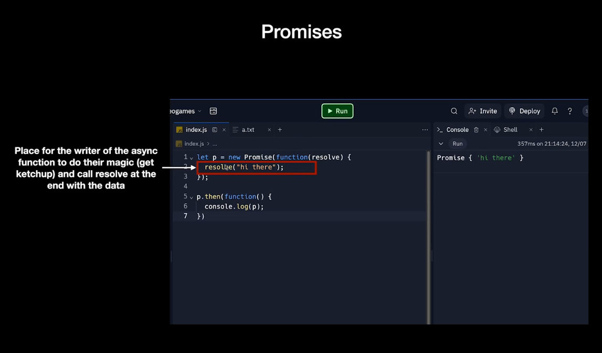
  
*  Promises are a way to handle asynchronous operations. They represent a value that may be available now, in the future, or never. A Promise allows you to work with async code without falling into `"callback hell"` making the code more readable and manageable.

`Examples:`
* Simple code without promises
  
  

* It is just a wrapper on top of another async function, which is fine. Usually, all async functions you will write will be on top of JS provided async functions like `setTimeout` or `fs.readFile` 

* Proper way  or cleaner way to write an asynch code
  
  

#### `NOTE :`
* Both give same result
  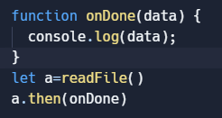
* same as above code
  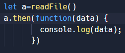

#### `NOTE :`
* CODE : In this console.log(ab) is having return value from displayresult i.e return "Result  is : " + data, so in this output is give n by console.log(ab)
  
  Ouput : 
  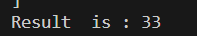
* CODE : In this the console.log(ab) is not having anything in return value from displayresult which is the last callabck function , and the output value is doing by function not by console.log(ab) 
  
  Output :
  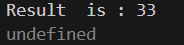

### `2.` `SOME USEFULL BUILT-IN METHODS `
* CONTENT :
  * 2.1 STRING
  * 2.2 NUMBERS
  * 2.3 ARRAYS 

#### `2.1` `String :` 
  * string.length 
  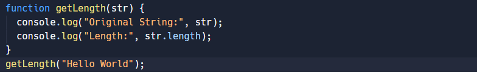
  * string.indexOf( ) 
  
  * string.lastIndexOf( )
  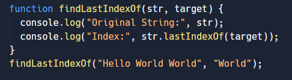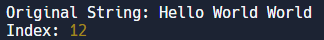
  * string.slice( ) 
  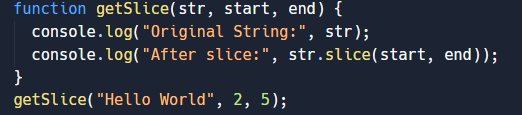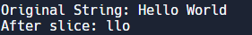
  * string.substring( )
  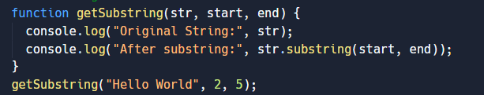
  * string.substr( )
  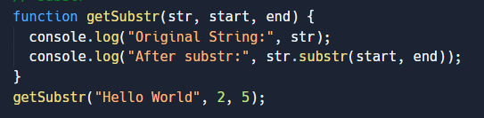
  * string.replace( )
  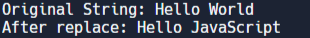
  * string.split( )
  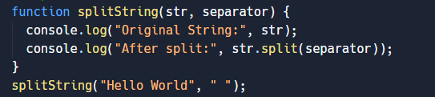
  * string.trim( )
  
  * string.toUpperCase( )
  
  * string.toLowerCase( )
  

#### `2.2` `Numbers :` 
* ParseInt
  
* ParseFloat 
  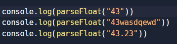

#### `2.3` `Arrays :` 
*  push()
*  pop()
*  shift()
*  unshift()
*  splice()
*  slice()
*  concat()
*  forEach()
*  map() 
*  filter() 
*  reduce()
*  find()
*  sort()
  
### `3.` `CLASSES`

* Input : In this we use normal methods which we can call with objetc only 
  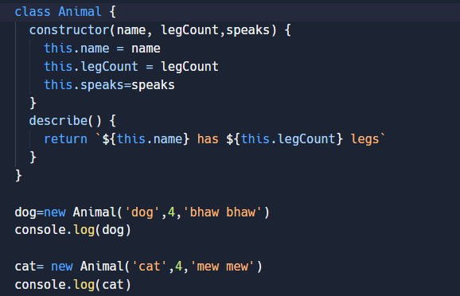
* Output :

#### `NOTE :`
* Input :
* Output :

### `4.` `DATES`
* Input :
  
* Output: 
  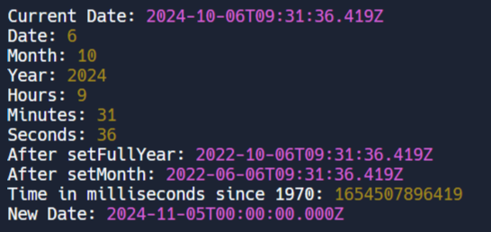 

* `Use Case :`
  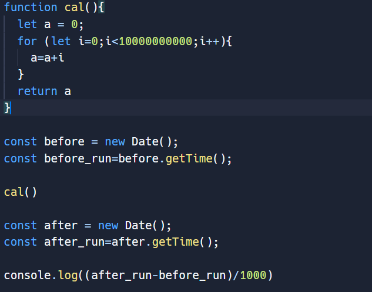
  

  
### `5.` `JSON `
* In this a JSON  string is converted into a json object by using `JSON.parse` and again converted into json string by using `JSON.stringify`
  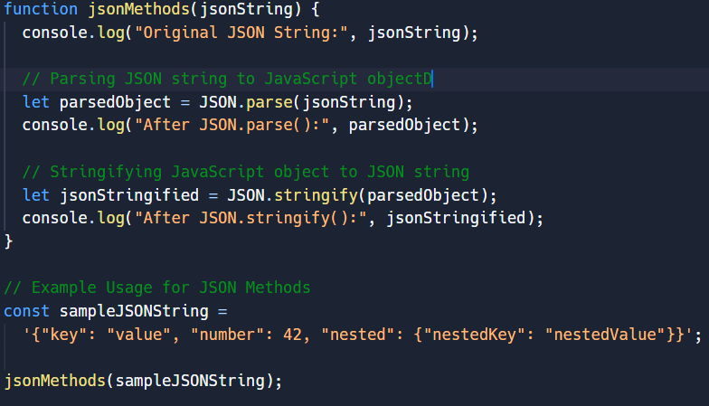
  
* EXAMPLE1 :
  
  

#### `NOTE : Difference b/w JSON and JS Object`

* `1.` JSON (JavaScript Object Notation):
  * JSON is a data format used to represent structured data as text.
  * It is strictly a string and can only store data, not functions or variables.
  * JSON keys and values must follow certain rules: keys are always strings (enclosed in double quotes), and values must be strings, numbers, booleans, arrays, or objects.
  * It is used for data exchange between systems, often in APIs and file storage.
  
  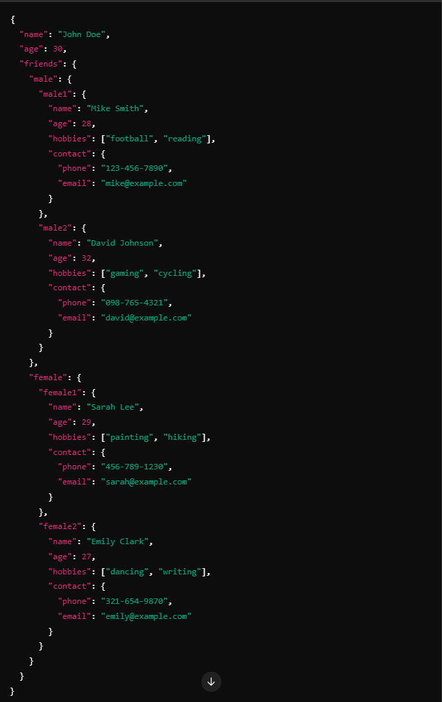

* `2.` JavaScript Object (JS Object):
  * A JavaScript object is a data structure in JavaScript that stores data in key-value pair
  * It can contain various data types (strings, numbers, booleans, arrays, functions, other objects).
  * The syntax allows you to use variables, functions, and more complex data types.
  * You can interact with JavaScript objects programmatically (e.g., manipulate properties, call methods).
  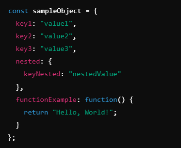

| Aspect         | JavaScript Object                    | JSON                                             |
|----------------|--------------------------------------|--------------------------------------------------|
| **Type**       | Native JavaScript object             | A string format used for data representation      |
| **Syntax**     | Can have variables, functions, etc.  | Only supports data (strings, numbers, arrays, booleans, objects) |
| **Usage**      | Used within JavaScript programs      | Used for data transfer (e.g., APIs, databases)    |
| **Quotes**     | Key names can be unquoted            | Keys must be double-quoted                       |
| **Data Types** | Supports complex types like functions, undefined, etc. | Supports limited types (no functions, undefined, etc.) |

### `6.` `MATHS`

### `7.` `OBJECTS`
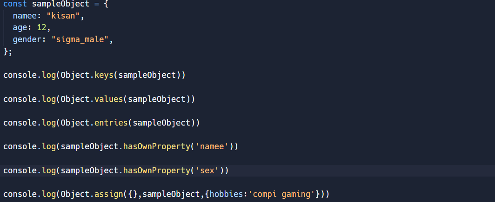

### `8.` `MAPS`

### `Week 2`

#### `1.` `Revison`
* Normal function : In which we are repeationg ourself for every individual task, for like in this sum of cubes,square.

* Using callback : we can generalize the task `"Notice the amount of space we cutoff just bcoz of call back"`

#### `2.` `Asynch/Await`
  The async and await syntax in JavaScript provides a way to write asynchronous code that looks and behaves like synchronous code, making it easier to read and maintain. It builds on top of Promises and allows you to avoid chaining .then() and .catch() methods while still working with asynchronous operations. async/await is essentially syntactic sugar on top of Promises.  

* Call back hell (Callbacks version)
  

* Call back hell (promisified version)
  

* Solved using asynch await
  

##### Assignment: 
`1.`Write code that
* logs hi after 1 second
* logs hello 3 seconds after step 1
* logs hello there 5 seconds after step 2

`2.` Write a function that
* Reads the contents of a file
* Trims the extra space from the left and right
* Writes it back to the file
* callback approach
  
* Promisified approach using asynch/await
  

* `NOTE :` 
  1. Things to keep in mind You can only call await inside a function if that function is async
  2. You cant have a top level await 

#### `3.` `Most used Commands` 

### `VARIABLES`
##### Const,let and var
* Const variable if u used so the value cant change with that function 
* In let var we can change the value 
* Var majorly not used ,bcoz issue in block scope and functional scope

#### BLOG
* In JavaScript, numbers and strings are primitive data types, not objects. However, they can be treated like objects in certain situations because JavaScript automatically wraps these primitives with object counterparts, called wrapper objects. This process is known as autoboxing.

* Wrapper objects : JavaScript provides Number and String  constructors, which are object versions of these primitives. When you try to access a method or property on a number or string primitive, JavaScript automatically wraps the primitive in a corresponding object (like Number or String) so that you can use object methods like .toFixed() or .toUpperCase().
* When you use new Number(100) in JavaScript, you're creating a Number object rather than a primitive number. This is generally not recommended because it can lead to unexpected behavior, as objects and primitive values behave differently.

* Equality checks :  When comparing a primitive number with a Number object, they are not strictly equal (===) because one is a primitive and the other is an object.

#### `NOTE :`
###### The difference between == (loose equality) and === (strict equality) in JavaScript is primarily about how they handle type coercion during comparison.
###### Use == when you want to allow type conversion and are okay with loose comparisons.Use === when you want to ensure both value and type match exactly, which is generally recommended for clearer and more predictable comparisons.
| Feature          | `==` (Loose Equality)                                  | `===` (Strict Equality)                                   |
|------------------|-------------------------------------------------------|----------------------------------------------------------|
| Type Coercion    | Yes, it performs type conversion before comparison.    | No, it does not perform type conversion; both operands must be of the same type. |
| Comparison        | Compares values after converting them to a common type. | Compares values without any conversion; both must be of the same type and value. |
| Examples          | `0 == '0'` is `true`                                 | `0 === '0'` is `false`                                  |
|                   | `null == undefined` is `true`                        | `null === undefined` is `false`                         |
|                   | `1 == true` is `true`                                | `1 === true` is `false`                                 |
|                   | `[] == 0` is `true`                                  | `[] === 0` is `false`                                   |

### `Meomery`
#####   `1. Stack ( used by primitive datatypes )`
#####   `2. Heap ( used by non primitive datatypes )`
*  Refers 05_Meomery_system.js to understand with below Scenario
  

#### 1. Stack (Primitive Data Types)
* Primitive data types in JavaScript include number, string, boolean, undefined, null, symbol, and bigint.
* Call by value: When you assign or pass a primitive value, a copy of the value is created and stored on the stack.
* The stack is a structured memory region that is fast and efficient, used to store static data like function calls, variables, and references.
* If you pass a primitive data type to a function, the function receives a copy of that value, meaning changes to the value inside the function do not affect the original.

#### 2. Heap (Non-Primitive Data Types)
* Non-primitive data types include objects, arrays, functions, etc.
* Call by reference: When you assign or pass a non-primitive data type, what is actually passed is a reference to the location in memory (in the heap) where the data is stored.
* The heap is used for dynamic memory allocation, meaning large, more complex objects are stored here, and the stack holds the reference to the memory address in the heap.
* When you pass an object to a function or assign it to another variable, both variables share the same reference, meaning changes to one will affect the other.
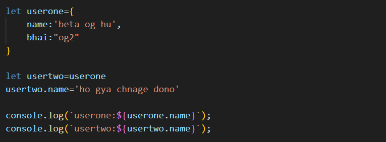

